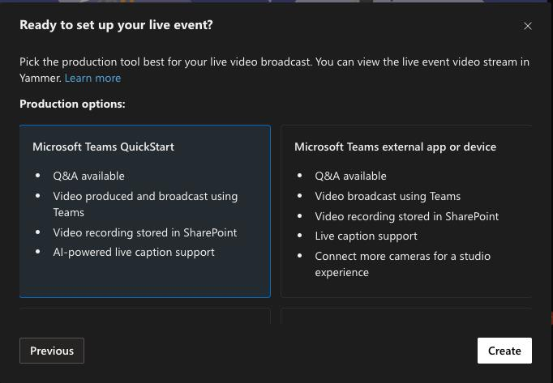
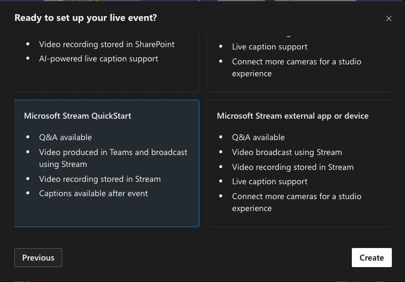

# Organize a Microsoft Teams powered live event in Yammer 

> [!NOTE]
> Yammer live events have historically used Stream live events for video processing. Microsoft is retiring Stream live events in September, 2023. Teams live events is the successor service that will allow you to create, host and produce live events within Yammer with the same functionality that you get with Stream.

> [!IMPORTANT]
> **To continue supporting our customers' needs, we will extend temporary limit increases for live events through June 30, 2023, including:**
> - Event support for up to 20,000 attendees
> - 50 events can be hosted simultaneously across a tenant
> - Event duration of 16 hours per broadcast
>
> Additionally, live events for up to 100,000 attendees can be requested through the [Microsoft 365 live events assistance program](https://resources.techcommunity.microsoft.com/live-events/assistance/). The team will assess each request and work with you to determine options that may be available. [Learn more.](https://aka.ms/Stream/Blog/LiveEventOptions)

> [!IMPORTANT]
> When setting up a live event, we recommend that you configure your video, community, and user permissions at least 24 hours before the event for the best experience. This includes such settings as adding users, updating video permissions, and changing a community from private to public. It can take up to two hours for certain changes to propagate across Microsoft Stream, Microsoft Teams, and Microsoft Yammer. Allowing 24 hours or more can provide time for testing and adjusting if needed.

Live events can be held in a public group to reach all employees or in a private group so that only those with membership in the group can participate.

This article lists the Yammer network requirements, licenses, and permissions for organizing and participating in live events.

## Types of live events

To understand how Yammer, Stream, and Teams work together in live events, see [Overview of live events](/microsoftteams/teams-live-events/what-are-teams-live-events#overview). Live events can be created and viewed in Yammer, Stream, or Teams. This article explains the requirements for creating and viewing a live event in Yammer.

> [!NOTE]
> Yammer live events have historically used Stream live events for video processing. Microsoft is retiring Stream live events in September, 2023. Teams live events is the successor service that will allow you to create, host and produce live events within Yammer with the same functionality that you get with Stream.

Yammer live events can be produced using Microsoft Stream or Teams. It is recommended that you use the new Teams options to produce events due to Microsoft retiring Stream live events.

## New recommended methods to produce Yammer live events using Microsoft Teams:

- **Use Microsoft Teams QuickStart**: This is used to produce simple live events where all you need are the audio and video devices connected to the presenter’s computer, or when you are inviting a remote presenter for the event. 
    - This type of event uses Teams to encode the broadcast stream. 
    - Uses Teams to share content from the presenter’s webcam and screen.
    - Attendees can view the event on Yammer. 
    - The video is stored in the SharePoint library connected to the Yammer community in which the live event was produced.

- **Use Teams external app or device**: This type of production is typically used for large-scale events such as executive town halls, where a single stream from a media mixer is broadcast to the audience. 
    - This type of event uses Teams to broadcast 
    - You will need to use an external encoder (app or device) to produce the event 
    - Attendees can view the event in Yammer. 
    - The video is stored in the SharePoint library connected to the Yammer community in which the live event was produced. 

## Microsoft Stream options that will be deprecated (not recommended):

- **Use Microsoft Stream external app or device**: This type of event is typically used for large-scale events such as executive town halls, where a single stream from a media mixer is broadcasted to the audience. 
    - This type of event uses Stream to encode the broadcast stream.
    - You need to use an external encoder (app or device) to produce the event.
    - Attendees view the event in Yammer.
    
- **Use Microsoft Stream QuickStart**: This is used for simple events when all you need are the audio and video devices connected to the presenter's computer, or when you're inviting a remote presenter for the event.
    - This type of event uses Teams to encode the broadcast stream.
    - Use Teams to share content from the presenters webcam and screen.
    - Attendees can view this event in Teams only.

## Yammer network and group requirements

 - To host a live event in Yammer, your organization must have **Enforce Office 365 identity** selected, and you must be using Microsoft 365 connected Yammer groups. 
 - For more information, see [Enforce Office 365 identity for Yammer users](../configure-your-yammer-network/enforce-office-365-identity.md) and [Yammer and Microsoft 365 groups](../manage-yammer-groups/yammer-and-office-365-groups.md).
 - The event must be held in either a public Yammer Microsoft 365 connected group, or a private Yammer Microsoft 365 connected group that includes everyone who will be invited to the live event. For more information, see [Create a group in Yammer](https://support.office.com/article/create-a-group-in-yammer-b407af4f-9a58-4b12-b43e-afbb1b07c889) and [Manage a group in Yammer](https://support.office.com/article/manage-a-group-in-yammer-6e05c6d6-5548-4c88-89cd-e6757a514ef2). 

## Requirements for live event attendees

- Everyone who attends a Yammer live event must have a Microsoft 365 or an Office 365 plan that includes a license for Yammer (for example, Office 365 A3, A5, F1, E1, E3, or E5) and Microsoft Stream.
- Only members of your Yammer network can attend live events. Guests and external users do not have access to live events.
- For live events in public groups, all members of your Yammer network can attend. For live events in private groups, attendees must be members of the private group in which the live event is hosted.

## Permissions for scheduling, creating, and producing live events in Yammer

Yammer has partnered with Teams and Stream to provide the best technology for running your live event. Because of this, creation and production of live events require Stream and/or Teams licenses and specific permissions. These permissions aren't controlled in Yammer settings. The requirements depend on the production methods you plan to use.

- **Scheduling**:

    - Only Yammer group admins can create and schedule a live event in Yammer.
    - When a live event is scheduled in Yammer, the organizer, any co-producers, and presenters will receive a calendar invite with information about this live event (as a placeholder). This invite is not sent to attendees.

- **Producing**:

    - **Events produced using an external app or device**:
       For external app or device events, the person who presents or produces the event must have a Stream license and permission to create live events. By default, only Microsoft Stream administrators have permission to create live events. Use the Stream admin settings to give permission to specific users. For steps to grant or remove permissions in Stream, see [Administration controls for live events in Stream](/stream/live-event-administration).

    - **Events produced using Teams**:
        The person who presents or produces the event must have a Teams license and specific policies set in Teams. For requirements, see [Who can create and schedule live events in Teams](/microsoftteams/teams-live-events/plan-for-teams-live-events#who-can-create-and-schedule-live-events). For steps to set policies, see [Set up live events policies](/microsoftteams/teams-live-events/set-up-for-teams-live-events#step-3-set-up-live-events-policies). 
 
### Restrict creation of live events in Yammer

You can prevent the creation of live events produced in teams, live events produced with other tools, or both.

- To prevent creation of live events produced in Teams, remove permissions in Teams for live event scheduling. If a user does not have a license or permission to create a live event in Teams, when they create a live event in Yammer, the produce in Teams option is unavailable.
- If you do not have permission to create live events in Stream, you cannot create live events in Yammer.

## FAQ

**Q: How many attendees can view a live event at once?**

A. Currently, the limit is 10,000 attendees. For larger attendee sizes, please contact the Microsoft 365 [Live Events Assistance Program](/stream/live-events-assistance).

**Q: What media player is used for live events?**

The new live events are broadcast using the Teams media player and can be viewed live or on-demand on Yammer’s Web and Mobile apps (iOS and Android).

**Q: Why can't I view the video?**

To maintain the privacy of live event content, only authorized users can join a live event and are authenticated as they load the live event page. If authentication isn't successful, you won't be able to view the video. To fix this, use your browser's settings to make sure that cookies are enabled and that any extensions that block tokens are disabled. After changing the settings, refresh the event page.

**Q: Where are the videos stored once they are produced?**

The Video-on-Demand is stored in the SharePoint Community where the event was hosted is automatically shared with members of the private community, or with everyone across the Yammer network if the event was produced in a public community.

**Q: Can Event Producers edit videos?**

Yes, the videos can be edited in SharePoint. The edited video in SharePoint is automatically updated for attendees to watch. Please note that it could take 10 minutes before producers can edit their videos after the event is completed.

**Q: What happens to the old live events videos that were produced using Microsoft Stream?**

Live Events videos created using Stream will continue to function - attendees can continue to watch those videos on demand broadcasted on Microsoft Stream. However, you should migrate those videos from Stream to SharePoint – see [this article](/stream/streamnew/stream-classic-to-new-migration-overview) on how to migrate content.

## Related articles

[Organize a live event in Yammer](https://support.office.com/article/organize-a-live-event-in-yammer-105dd7af-9caf-4a5e-8a44-56d203e96551)

[Microsoft Teams live events overview](https://support.office.com/article/get-started-with-microsoft-teams-live-events-d077fec2-a058-483e-9ab5-1494afda578a)

[Microsoft Stream live events overview](/stream/live-event-overview)

[Get help producing a live event](https://support.office.com/article/0cedb557-cbe4-40d3-8147-112633f087eb)
